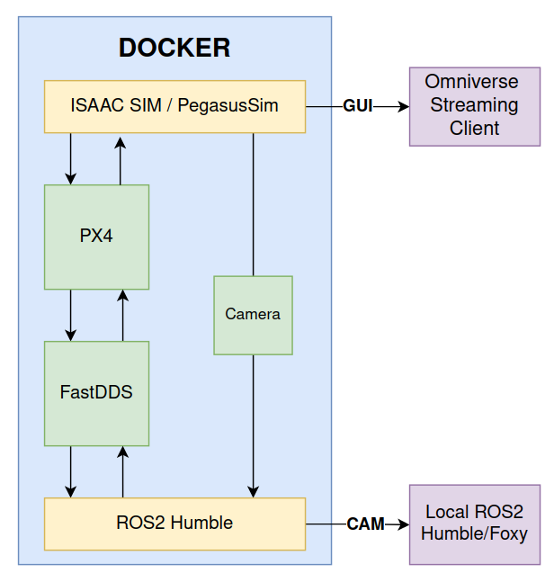

# Aerial Robotics 2024 ISAAC Racing Challenge
This repository containes all files necessary to compete in the ISAAC Challenge during Aerial Robotics course (summer 2024).

### Setup

### Used tools:
1. ISAAC-SIM - https://developer.nvidia.com/isaac-sim
2. ROS2 Humble - https://docs.ros.org/en/humble/index.html
3. PX4-Autopilot - https://docs.px4.io/main/en/
4. Fast-DDS - https://docs.px4.io/main/en/ros/ros2_comm.html
5. PegasusSimulator - https://pegasussimulator.github.io/PegasusSimulator/

### How to set up this container?
1. Clone this repository.
2. Open repository in VSCode.
3. Reopen repository in container (left bottom in VSCode).
4. Run `./initialize_image.sh` command inside container.
5. The container is ready to be used.

### Preparation (if you want to run it at home)
1. Make sure that you have a [compatible](https://docs.omniverse.nvidia.com/isaacsim/latest/installation/requirements.html) NVIDIA GPU for ISAAC SIM.
2. Set up [nvidia-container](https://docs.omniverse.nvidia.com/isaacsim/latest/installation/install_container.html) (till the end).
3. Install [Omniverse Streaming Client](https://docs.omniverse.nvidia.com/streaming-client/latest/user-manual.html).
4. If you want to access ROS2 topics outside of container, install [ROS2 Humble or Foxy](https://docs.ros.org/en/foxy/Installation/Ubuntu-Install-Debians.html). 

### How to run demo? (takeoff)
Open 1st terminal and...
1. Source ROS2 with `source /opt/ros/humble/setup.bash`
2. Run `export FASTRTPS_DEFAULT_PROFILES_FILE=/workspaces/ar_challenge_isaac/fastdds.xml`
3. Run ISAAC SIM demo with `"/isaac-sim/python.sh /workspaces/ar_challenge_isaac/demo.py"`
4. You can access ISAAC SIM GUI with Omniverse Streaming Client (default server).

Open 2nd terminal and...
1. Go to `cd /workspaces/px4_ros2_comm_ws` directory.
2. Source ROS2 with `source /opt/ros/humble/setup.bash`
3. Set up workspace with `source ./install/setup.sh` 
4. Run PX4-ROS2 communication with `MicroXRCEAgent udp4 -p 8888`

Open 3rd terminal and...
1. Go to `cd /root/PX4-Autopilot` directory.
2. Run PX4 backend with `make px4_sitl none_iris`

## Goal formulation
The goal of this challenge is to implement control for a UAV to complete three laps of a race around a track marked with gates. The obligatory task takes into account a race based on a set trajectory. The trajectory is to be determined on the basis of the position of the gates. An additional task is the implementation of control without a predetermined trajectory. This is done using the UAV-mounted camera and the detection of ArUco markers mounted on the gates. 

## Initial conditions
The gates located at different heights on the stage area (warehouse) constitute the race route. Once the entire demo is running (simulation, PX4, Fast-DDS communication), the publlishers and subscribers necessary to control the UAV and access the sensors are available in the ROS environment (you can list them with `ros2 topic list`). 

## Evaluation
The way to evaluate the solution will be the time it takes to complete three laps of the race. The time required for takeoff should not be taken into account. The race time will be counted as the time between the first and last passing of the first gate. 

## Tips
A good way to start approaching the challenge is to familiarise yourself with the environment used (including ISAAC SIM with PegasusSimulator, PX4 and ROS2). In this challenge, control of the drone is performed by the PX4 autopilot and executed by ROS2 via Fast-DDS communication. The links found in this `README` in the `Used Tools` section will be useful (especially PX4 documentation and ROS2 tutorials). A simple sample UAV [offboard control](https://docs.px4.io/main/en/ros/ros2_offboard_control.html) (takeoff) application from the `px4_ros_com` package, can be used as a starting point. Try running it as follows:

Open 4th terminal and...
1. Go to `cd /workspaces/px4_ros2_comm_ws` directory.
2. Source ROS2 with `source /opt/ros/humble/setup.bash`
3. Set up workspace with `source ./install/setup.sh` 
4. Run example ROS2 drone control (takeoff) with `ros2 run px4_ros_com offboard_control`
5. You can also use adittional terminal to run sensors listener with `ros2 launch px4_ros_com sensor_combined_listener.launch.py`
